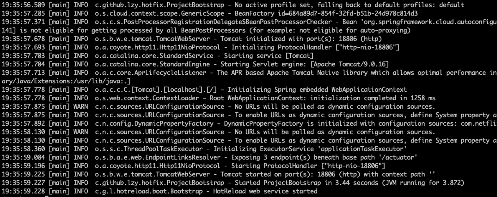
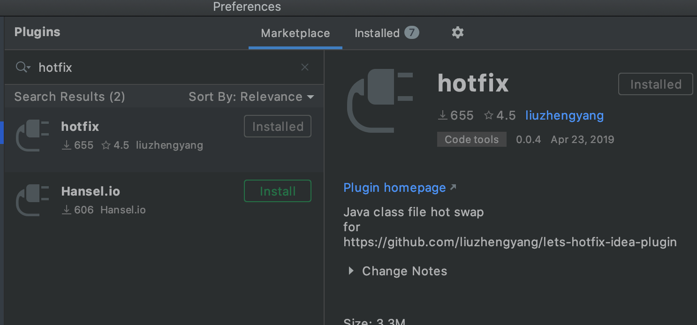
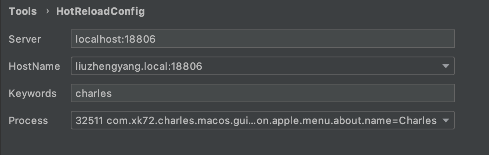
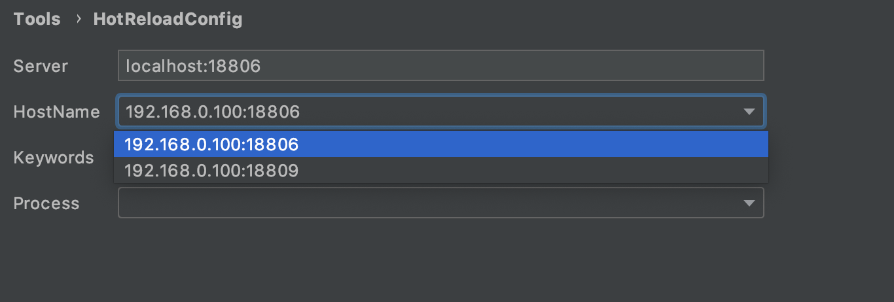

## 本版本的设计(agent,plugin,server)有不少缺点，有时间我再实现新的设计

# lets-hotfix
Class hot reload for java

[](https://travis-ci.com/liuzhengyang/lets-hotfix)

# Java代码热更新工具，节省宝贵开发时间

## 一、背景

在平时的开发过程中，开发流程一般是，编写/修改代码 -> 编译/打包 -> 部署/重启服务 -> 测试刚才的代码 -> 编写/修改代码 -> 编译/打包...这样的一个循环。

### 常见问题场景

下面的场景是否很熟悉呢？
>  
小明: 小张，我这个接口开发好了，在测试环境部署好了，你调用下吧。   
小张: 小明，这个请求结果不对，bla bla bla   
小明: 不应该呀，我查一查。哎呀看不出来，要是这里有日志就好了，我加个日志重新部署下吧。小明开始修改代码，本地打包3分钟，上传测试机1分钟，测试机服务重新启动5分钟。   
小明: 哎呀，原来是这里判断写反了，我修改下重新部署下。十分钟过去了...哎呀，那里又错了，我修改下。又十分钟过去了...   
转眼晚上11点多了，小张已经不耐烦提前下班了。   
小明: 要是能修改完代码在测试环境立马生效就好了，今天就能早点下班了
>

### 问题分析

这个步骤中最耗时的部分是重新编译打包、重启服务阶段，时长和项目的大小等因素有关，但是一般都会有数分钟的时间。   
时间上的浪费是一方面，注意力切换的成本也是巨大的，这段时间的中断类似于cpu停止执行当前任务、切换到其他任务，再切换回来需要上下文切换成本。   

比如在等待打包或者部署启动的过程中，开发者一般会去做一些其他事情，像处理其他的项目、出去买个咖啡等等，等切换回这个任务时，任务上下文已经丢失了，需要再花点时间思考之前之前做了啥，接下来要做啥，如此往复。

## 二、Java热更新工具

Java代码热更新工具正是为了解决这种痛点开发的，修改完代码，通过IDEA插件直接更新到测试环境生效（同时支持本地和远程模式）。   
整个过程流畅快捷，帮助你节省时间、节省精力，留出时间做更重要的事情。   
修改后能够立即生效看到结果，这样的实时反馈的价值也是巨大的，能够实现所见即所得，What you see is what you get。

### 使用方式

代码热更新工具支持远程模式和本地两种模式，下面先以远程模式举例。

#### 1. 目标测试机部署agent

一个机器只需安装一次agent，在测试机中运行如下命令即可。
```
curl -s https://raw.githubusercontent.com/liuzhengyang/lets-hotfix/master/bin/boot.sh | bash /dev/stdin -localMode
```


#### 2. 安装IDEA插件

点击IDEA页面左上角IntelliJ IDEA -> Preferences -> Plugins，搜索hotfix，安装即可。


#### 3. IDEA插件配置

点击IDEA页面左上角IntelliJ IDEA -> Preferences -> Tools -> HotReloadConfig   
Server中填写 `localhost:18806` 我这里是本地安装，如果是远程安装，则填写对应的ip:port，或者nginx代理域名，文章最后介绍下多个测试机自动注册的使用场景      
HostName选择自己的测试机   
keyword 填写自己Java进程的唯一标识，用于筛选自己的java进程，可以用启动参数或进程id来筛选，例如tomcat服务一般都有一个唯一的端口号可以用端口号筛选，rpc等服务也都是可以的。   
填写完后，Process会展示筛选后的进程，可以再确认一次。   
完成后，点击Apply OK保存。

一个填写示例如下   


#### 4. 开始修改代码

修改完代码后，在编辑器中右键 -> Hot Reload，或者使用快捷键`Cmd + Shift + L`，便可以立即热更新了。   
下面用一个gif图演示一下


### 热更新支持范围

**1.默认情况下，只支持方法体内的修改热更新，不能增加/删除字段或增加/删除方法。**

**如果希望增减字段、方法，可以使用特定的jdk(dcevm)来启动。下载命令方法如下**
```
wget https://github.com/TravaOpenJDK/trava-jdk-11-dcevm/releases/download/dcevm-11.0.6%2B1/java11-openjdk-dcevm-linux.tar.gz
tar -zxvf java11-openjdk-dcevm-linux.tar.gz 
```
然后使用`dcevm-11.0.1+8/bin/java`来启动你的java进程就可以支持增减字段方法了，并且dcevm也支持很多spring的功能，很强大。

### 自动注册模式

如果测试机较多，并且不能直连测试机的话，给每个测试机配置nginx是一个比较麻烦的事情，所以HotReload工具也支持代理注册模式。
首先找一个机器启动一个集中的使用eureka的注册中心。
```
wget https://maven.aliyun.com/repository/public/com/github/liuzhengyang/hotreload-registry/1.0.8/hotreload-registry-1.0.8.jar
java -jar hotreload-registry-1.0.8.jar
```
然后启动hotreload-boot的时候，增加参数 --eurekaServer xxx:8761，xxx是启动eureka那个机器的ip或hostname



### 端口冲突怎么办

可以通过 --port 指定port，例如 --port 18809

## 三、实现原理简介

项目源码在[lets-hotfix](https://github.com/liuzhengyang/lets-hotfix)。   
整个项目分为三个部分，idea插件，测试机上的hotreload-web，和一个hotreload-agent。   
idea插件负责编译修改完的代码，把修改后的class上传给测试的hotreload-web，然后hotreload-web会动态链接到你的目标Java进程。   
动态链接使用的是java [attach](https://docs.oracle.com/en/java/javase/11/docs/api/jdk.attach/module-summary.html)模块的功能，链接的同时会加载hotreload-agent。   
链接上之后，hotreload-agent启动可以获得一个[`Instrumentation`](https://docs.oracle.com/en/java/javase/11/docs/api/java.instrument/java/lang/instrument/Instrumentation.html)对象，通过`Instrumentation`对象的`retransformClasses​`便可以实现类的重定义，也就是热更新了。

## 四、总结

感谢大家阅读，上述便是Java代码热更新的使用方式和原理介绍了，欢迎大家点击[star](https://github.com/liuzhengyang/lets-hotfix)支持鼓励，后续为大家带来更多好用的工具


